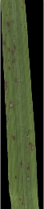
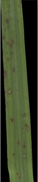
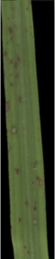
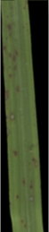

## Blur image

***

This parameter blurs the image. It will take the average of the pixels and replace the pixel by the average of the pixels around.

This helps avoid errors in classification. For example, a light brown pixel may be wrongly assigned to the background, however by blurring the image it is likely to be classified with its neighboring pixels.

<table class="table-info">
<thead>
<tr>
	<th>Original</th>
	<th>Blur 1</th>
	<th>Blur 3</th>
	<th>Blur 5</th>
	<th>Blur 7</th>
	<th>Blur 9</th>
	<th>Blur 11</th>
	<th>Blur 13</th>
	<th>Blur 15</th>
	<th>Blur 17</th>
	<th>Blur 19</th>
	<th>Blur 21</th>
</tr>
</thead>

<tbody>
<tr>
	<td></td>
	<td></td>
	<td></td>
	<td></td>
	<td></td>
	<td></td>
	<td></td>
	<td></td>
	<td></td>
	<td></td>
	<td></td>
	<td></td>
</tr>

</tbody>
</table>
