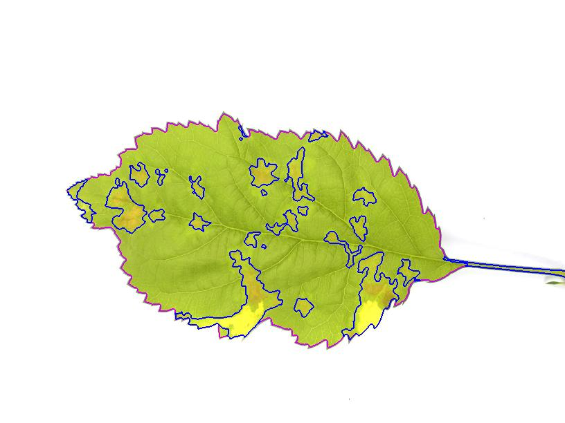

## Leaf color border

***

You can choose the color of the leaf as well as the color of the leaf border.
If you choose a more transparent color for the body of the leaf and a more opaque color for the border, this allows you to better determine whether the leaf have been correctly detected in the analysis.

***
