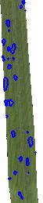
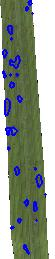
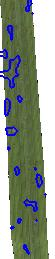
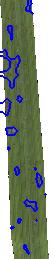

## Lesion border size

***

This parameter dilates the lesions and then fills any holes that escaped detection.
It then returns the lesion to its original size, reversing the dilation.
Changing this parameter can ensure that the analysis takes into account the entire surface of the lesions.
If two lesions are close together, increasing the number of pixels can result in the merging of the lesions in your analysis.

<table class="table-info">
<thead>
<tr>
	<th>Value 1</th>
	<th>Value 3</th>
	<th>Value 5</th>
	<th>Value 7</th>
	<th>Value 9</th>
	<th>Value 11</th>
	<th>Value 13</th>
</tr>
</thead>

<tbody>
<tr>
	<td></td>
	<td></td>
	<td></td>
	<td></td>
	<td></td>
	<td></td>
	<td></td>
</tr>

</tbody>
</table>

***
**Info**  brush is circle so program round value to impair int
