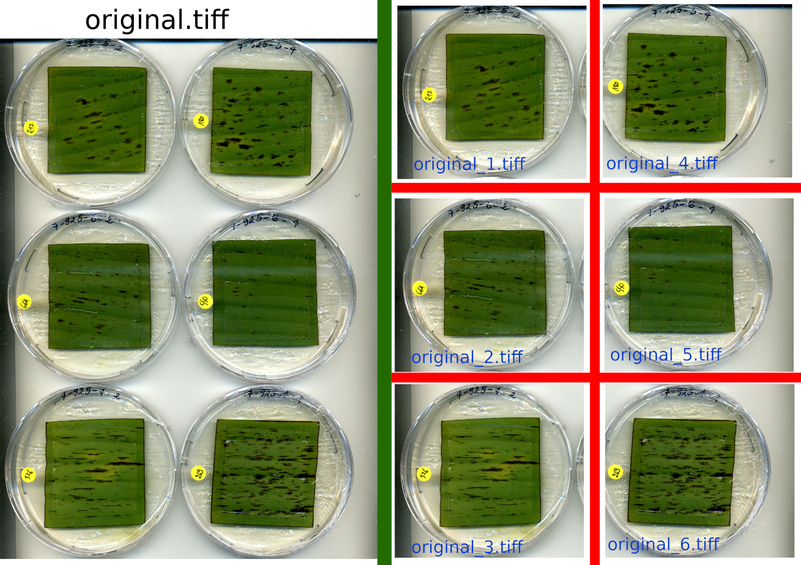
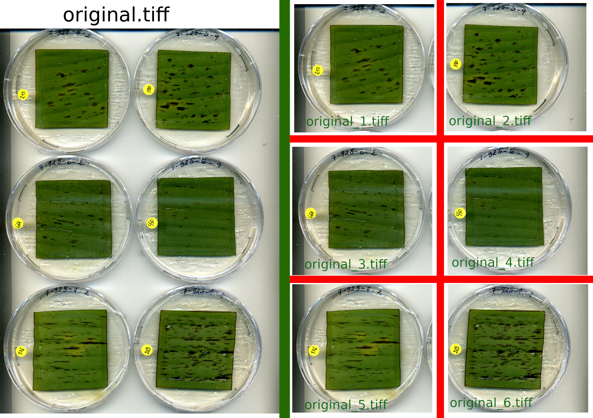

## output Number parameter

***

The order to numerote output image "left from right" or "top to buttom"

<table>
  <td>
    Exemple with "bottum":
    
  </td>
  <td>
    Exemple with "right":
    
  </td>
</table>
